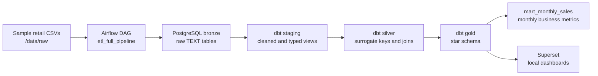

# Retail Sales Analytics Warehouse

Local Docker portfolio project for a small retail analytics warehouse built
from sample CSV data. The stack loads raw files into PostgreSQL with Airflow,
transforms them with dbt, validates the warehouse with dbt schema tests, and
exposes the gold layer to Superset.

This is intentionally a local portfolio project, not production-scale cloud
infrastructure. It does not use Kafka, Spark, or managed cloud services.

## Portfolio Status

Latest verified Airflow run:

`manual__codex_portfolio_20260517_160453` - success

| Check | Result |
|-------|--------|
| Airflow tasks | 7 passed |
| Bronze tables loaded | 4 passed |
| dbt run | `PASS=14 WARN=0 ERROR=0 SKIP=0 TOTAL=14` |
| dbt test | `PASS=108 WARN=0 ERROR=0 SKIP=0 TOTAL=108` |
| Monthly mart rows | 12 |

## Architecture



## Verified Airflow Run

| Airflow task | Status |
|--------------|--------|
| `load_raw.load_regions` | success |
| `load_raw.load_clients` | success |
| `load_raw.load_products` | success |
| `load_raw.load_orders` | success |
| `silver.run_dbt_staging` | success |
| `silver.run_dbt_silver` | success |
| `gold.run_dbt_gold` | success |

## Bronze Row Counts

| Bronze table | Rows |
|--------------|------|
| `bronze.regions` | 5 |
| `bronze.clients` | 10 |
| `bronze.products` | 10 |
| `bronze.orders` | 60 |

## Stack Overview

| Service | Purpose | URL | Login |
|---------|---------|-----|-------|
| PostgreSQL | Local analytics warehouse | `localhost:5432` | `admin / admin` |
| Airflow | ETL orchestration | `http://localhost:8088` | `admin / admin` |
| dbt HTTP | dbt run/test trigger service | `http://localhost:8087` | none |
| Superset | Dashboarding and SQL exploration | `http://localhost:8089` | `admin / admin` |

Warehouse layers:

| Layer | Description |
|-------|-------------|
| `bronze` | Raw CSV data loaded as TEXT columns |
| `silver` | Cleaned, typed, joined models with surrogate keys |
| `gold` | Star schema dimensions, fact table, and monthly mart |

## Quick Start

```bash
docker compose up -d --build
```

Wait for the services to initialize, then open Airflow:

```text
http://localhost:8088
```

Trigger the DAG:

```text
etl_full_pipeline
```

Run dbt directly through the local HTTP service:

```bash
curl -X POST http://localhost:8087/run
curl -X POST http://localhost:8087/test
```

## Project Structure

```text
data/raw/
  clients.csv
  orders.csv
  products.csv
  regions.csv

dags/
  etl_pipeline.py

dbt/
  dbt_project.yml
  profiles.yml
  models/
    staging/
      stg_*.sql
      schema.yml
    silver/
      silver_*.sql
      schema.yml
    gold/
      dim_*.sql
      fact_sales.sql
      schema.yml
      marts/
        mart_monthly_sales.sql

init/
  init.sql
  superset_start.sh
  superset_setup.py
```

## What I Changed

This repo started as an educational skeleton. I extended it into a runnable
local portfolio project by adding and verifying:

- Airflow CSV loaders for `regions`, `clients`, `products`, and `orders`.
- Correct Docker-mounted raw data path: `/opt/data/raw`.
- dbt HTTP calls from Airflow for staging, silver, and gold model runs.
- dbt staging models that trim, clean, and type raw bronze data.
- dbt silver models with deterministic surrogate keys and relationship joins.
- dbt gold star schema with dimensions and `fact_sales`.
- `gold.mart_monthly_sales` for monthly GMV, order count, customer count, and average order value.
- dbt schema tests across staging, silver, gold, and the monthly mart.
- README documentation with verified local run results.

## Data Model

Gold-layer models:

| Model | Grain |
|-------|-------|
| `dim_region` | One row per region |
| `dim_client` | One row per client |
| `dim_product` | One row per product |
| `dim_date` | One row per order date |
| `fact_sales` | One row per order line |
| `mart_monthly_sales` | One row per month |

`mart_monthly_sales` includes:

- `gmv`
- `order_count`
- `customer_count`
- `average_order_value`

## Troubleshooting

| Symptom | What to check |
|---------|---------------|
| Airflow task stuck in queued | Confirm the DAG is unpaused and the scheduler is running. |
| Raw load cannot find CSV files | The Airflow container reads files from `/opt/data/raw`. |
| dbt endpoint returns an error | Check `docker compose logs dbt` for the SQL or model failure. |
| Superset dashboard is empty | Run the Airflow DAG first so the gold tables exist. |
| Port conflict | Check local usage of ports `5432`, `8087`, `8088`, and `8089`. |

## Attribution

This project was adapted from an open-source educational repository and
extended into a portfolio-ready local retail analytics warehouse. My additions
focus on making the pipeline runnable end to end with Airflow and dbt, adding
dbt schema tests, and creating a monthly sales mart for portfolio analysis.

It is a small local Docker project using sample retail data, not production
infrastructure.
